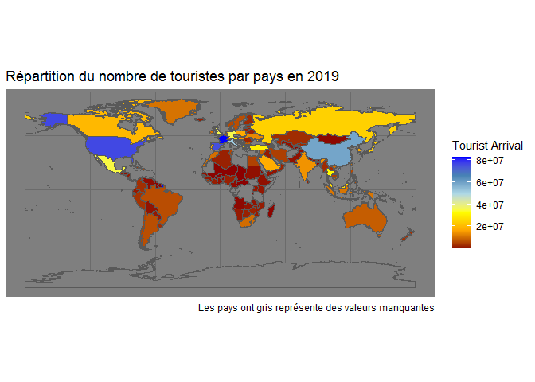

# Algerian R Users Group live demo

In this demo, I tried to map the distribution of international tourists
arrival per country in 2019. The video (in Algerian dialect) can be
found
[here](https://www.facebook.com/FaUx.DiLz.IHa/videos/3302395576438655/?comment_id=3060255194025475&notif_id=1586632143270686&notif_t=group_comment)

## Loading the tidyverse package

``` r

library(tidyverse)
#> -- Attaching packages --------- tidyverse 1.3.0 --
#> v ggplot2 3.3.0     v purrr   0.3.3
#> v tibble  3.0.0     v dplyr   0.8.5
#> v tidyr   1.0.2     v stringr 1.4.0
#> v readr   1.3.1     v forcats 0.5.0
#> -- Conflicts ------------ tidyverse_conflicts() --
#> x dplyr::filter() masks stats::filter()
#> x dplyr::lag()    masks stats::lag()
```

## Extracting the data

``` r
library(ralger)

data <-
  table_scrap("https://worldpopulationreview.com/countries/most-visited-countries/")
```

## Cleaning the columns’ names

``` r

data <- janitor::clean_names(data)
```

## Converting the character column to numeric

``` r

data$international_tourist_arrivals <-
  parse_number(data$international_tourist_arrivals, na = "..")
```

## Getting the sf data

``` r

library("rnaturalearth")
library("rnaturalearthdata")

world <- ne_countries(scale = "large", returnclass = "sf")


# The USA problem
world$sovereignt  <-
  world$sovereignt %>%  str_replace_all("United States of America", "United States")

  
```

## Joining the datasets

``` r

final_data <-
  world %>% left_join(data, by = c("sovereignt" = "country"))
```

## Plotting the distribution of internation tourists around the world

``` r


ggplot(final_data) +
  geom_sf(aes(fill = international_tourist_arrivals)) +
  scale_fill_gradientn(colours = c("darkred", "orange", "yellow",
                                   "lightblue", "steelblue", "blue")) +
  labs(fill = "Tourist Arrival",
       title = "Répartition du nombre de touristes par pays en 2019",
       caption = "Les pays en gris représentent des valeurs manquantes") +
  theme_dark()
```

<!-- -->
